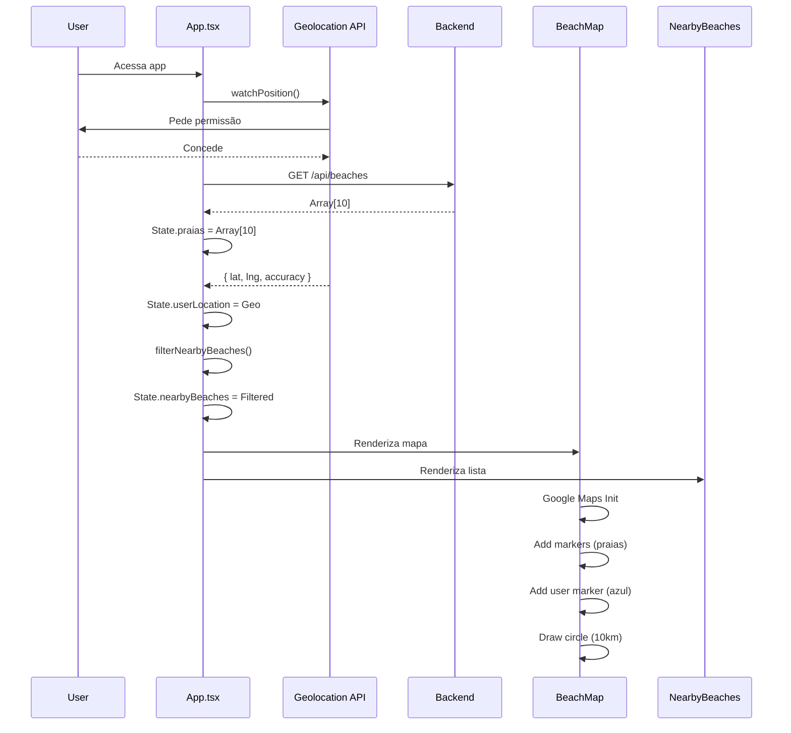

# 🏗️ Spec - Arquitetura

**Referência**: [SPEC_INDEX.md](SPEC_INDEX.md) | Anterior: [SPEC_DECISIONS.md](SPEC_DECISIONS.md)

---

## 🏗️ Arquitetura em Camadas

```
┌─────────────────────────────────────────────────┐
│ PRESENTATION LAYER                              │
├─────────────────────────────────────────────────┤
│                                                 │
│  ┌─────────────────────────────────────────┐   │
│  │ BeachMap Component                      │   │
│  │ (Google Maps + Markers)                 │   │
│  └─────────────────────────────────────────┘   │
│                                                 │
│  ┌─────────────────────────────────────────┐   │
│  │ NearbyBeaches Component                 │   │
│  │ (List + Cards)                          │   │
│  └─────────────────────────────────────────┘   │
│                                                 │
└────────────────┬────────────────────────────────┘
                 │
┌────────────────▼────────────────────────────────┐
│ BUSINESS LOGIC LAYER                            │
├─────────────────────────────────────────────────┤
│                                                 │
│  ┌─────────────────────────────────────────┐   │
│  │ App Component (State Orchestration)     │   │
│  │ - userLocation                          │   │
│  │ - nearbyBeaches                         │   │
│  │ - selectedBeach                         │   │
│  └─────────────────────────────────────────┘   │
│                                                 │
│  ┌──────────────────┐  ┌──────────────────┐    │
│  │ useGeolocation   │  │ useFetchBeaches  │    │
│  │ Hook             │  │ Hook             │    │
│  └──────────────────┘  └──────────────────┘    │
│                                                 │
└────────────────┬────────────────────────────────┘
                 │
┌────────────────▼────────────────────────────────┐
│ DATA LAYER                                      │
├─────────────────────────────────────────────────┤
│                                                 │
│  ┌──────────────────────────────────────────┐  │
│  │ Utils                                    │  │
│  │ ├─ calculateDistance (Haversine)        │  │
│  │ ├─ filterNearbyBeaches                  │  │
│  │ └─ Beach interface                      │  │
│  └──────────────────────────────────────────┘  │
│                                                 │
│  ┌──────────────────────────────────────────┐  │
│  │ API Service (Axios)                      │  │
│  │ └─ GET /api/beaches (30s polling)       │  │
│  └──────────────────────────────────────────┘  │
│                                                 │
└────────────────┬────────────────────────────────┘
                 │ HTTP
┌────────────────▼────────────────────────────────┐
│ BACKEND (Express)                               │
├─────────────────────────────────────────────────┤
│                                                 │
│  GET /api/beaches → data/bahia-beaches.json    │
│                                                 │
└─────────────────────────────────────────────────┘
```

---

## 📡 Fluxo de Dados

### 1️⃣ Inicialização

```
App Monta
  ├─ useGeolocation inicia watchPosition()
  │  └─ Request geolocalização ao usuário
  │
  └─ useFetchBeaches dispara GET /api/beaches
     └─ Recebe array de 10 praias
        └─ Armazena em state (praias)
```

### 2️⃣ Atualização Geolocalização (a cada 10s)

```
watchPosition() atualiza
  ├─ Nova posição recebida
  ├─ State userLocation Updated
  │
  └─ useEffect detecta mudança
     └─ Recalcula praias próximas
        ├─ filterNearbyBeaches()
        │  ├─ Loop praias
        │  ├─ calculateDistance (Haversine)
        │  └─ Filtra raio 10km
        │
        └─ State nearbyBeaches Updated
           ├─ BeachMap re-renderiza
           └─ NearbyBeaches re-renderiza
```

### 3️⃣ Polling de Praias (a cada 30s)

```
Intervalo de Polling
  ├─ GET /api/beaches
  ├─ Backend retorna array
  ├─ App atualiza state (praias)
  │
  └─ useEffect detecta mudança
     └─ Recalcula praias próximas
        └─ Re-renderiza componentes
```

---

## 🔄 Sequência: User Abre App



---

## 🎯 Componentes Principais

### App.tsx
**Responsabilidade**: Orquestrar estado e data flow

```typescript
State:
  - userLocation: Location | null
  - beaches: Beach[]
  - nearbyBeaches: Beach[]
  - selectedBeach: Beach | null

Effects:
  - watchPosition (10s)
  - pollBeaches (30s)
  - recalc nearbyBeaches quando userLocation muda

Render:
  - BeachMap
  - NearbyBeaches
```

### BeachMap.tsx
**Responsabilidade**: Renderizar Google Maps com marcadores

```typescript
Props:
  - beaches: Beach[]
  - nearbyBeaches: Beach[]
  - userLocation: Location | null
  - onSelectBeach: (beach) => void
  - selectedBeach: Beach | null

Features:
  - Google Maps instance
  - Beach markers (vermelho)
  - User marker (azul)
  - Circle 10km
  - Click handlers
```

### NearbyBeaches.tsx
**Responsabilidade**: Listar praias ordenadas por proximidade

```typescript
Props:
  - beaches: Beach[]
  - userLocation: Location | null
  - onSelectBeach: (beach) => void
  - selectedBeach: Beach | null

Features:
  - Ordena por distância
  - Cards com nome + distância
  - Scroll vertical
  - Highlight selecionada
```

### useGeolocation() Hook
**Responsabilidade**: Gerenciar watchPosition

```typescript
Returns:
  - location: Location | null
  - error: string | null
  - isLoading: boolean

Internals:
  - watchPosition() setup
  - Error handling
  - Cleanup on unmount
```

### distance.ts Utils
**Responsabilidade**: Calcular distâncias (Haversine)

```typescript
Exports:
  - calculateDistance(lat1, lng1, lat2, lng2): number
  - filterNearbyBeaches(userLat, userLng, beaches, radius): Beach[]
  - Beach interface
  - Location interface
```

---

## 📊 State Management

### State Global (App.tsx)

```typescript
// User Location
userLocation: {
  lat: number
  lng: number
  accuracy: number
}

// Data
beaches: Beach[]     // 10 praias (da API)
nearbyBeaches: Beach[] // Filtradas (<= 10km)

// UI
selectedBeach: Beach | null
isSidebarOpen: boolean
```

### Managed By
- **userLocation**: `watchPosition()` hook
- **beaches**: Polling HTTP a cada 30s
- **nearbyBeaches**: useEffect calculated
- **selectedBeach**: onClick handlers

---

## 🔌 Integrations

### Google Maps API
- **Provider**: `@googlemaps/js-api-loader`
- **Features**: Base map, markers, circles
- **Cost**: Incluído em projeto

### Browser APIs
- **Geolocation API**: `navigator.geolocation.watchPosition()`
- **Performance**: Zero npm deps

### Axios
- **Purpose**: HTTP polling
- **Endpoint**: `GET http://localhost:3000/api/beaches`
- **Interval**: 30s

---

## 📁 Estrutura de Diretórios

```
src/
├── App.tsx                    (Orquestração)
├── components/
│   ├── BeachMap.tsx          (Mapa)
│   ├── NearbyBeaches.tsx    (Lista)
│   └── ...
├── hooks/
│   ├── useGeolocation.ts     (Geo)
│   └── useFetchBeaches.ts    (API polling)
├── utils/
│   ├── distance.ts           (Haversine)
│   └── filterNearbyBeaches.ts
├── types/
│   └── index.ts              (Interfaces)
└── main.tsx

server.ts                      (Express)
├── routes/
│   └── beaches.ts            (GET /api/beaches)
└── data/
    └── bahia-beaches.json    (10 praias)
```

---

## 🚀 Data Flow Diagrama

```
                    ┌──────────────┐
                    │   Browser    │
                    └──────┬───────┘
                           │
           ┌───────────────┼───────────────┐
           │               │               │
      ┌────▼────┐  ┌──────▼──────┐  ┌─────▼────┐
      │Geoloc   │  │ useEffect   │  │ Interval │
      │API      │  │ (trigger)   │  │ (30s)    │
      └────┬────┘  └──────┬──────┘  └─────┬────┘
           │               │               │
           └───────────────┼───────────────┘
                           │
                    ┌──────▼───────┐
                    │  App.tsx     │
                    │  State Mgmt  │
                    └──────┬───────┘
                           │
           ┌───────────────┼───────────────┐
           │               │               │
      ┌────▼─────────┐ ┌──▼──────────┐ ┌──▼───────────┐
      │BeachMap.tsx  │ │NearbyBeach  │ │ filterNearby │
      │(Render)      │ │ es.tsx      │ │ Beaches()    │
      └──────────────┘ │(Render)     │ │(Utils)       │
                       └─────────────┘ └──────────────┘
```

---

**Próximo**: [SPEC_API.md](SPEC_API.md)
