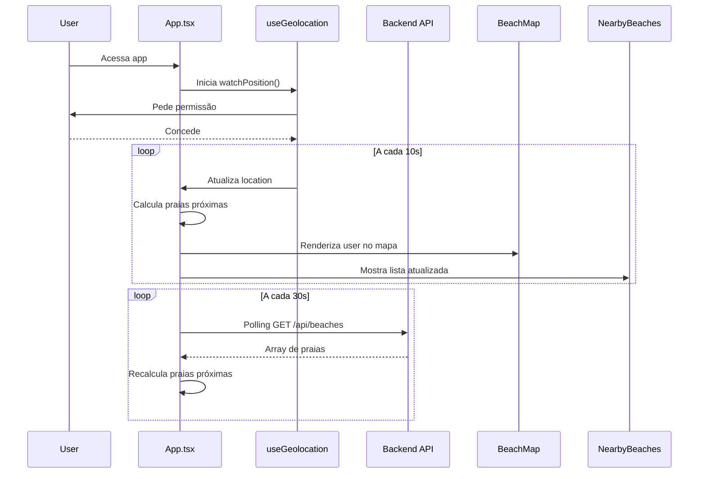

# 📍 Spec MVP - Geolocalização em Tempo Real

**Data**: 14 de maio de 2026  
**Versão**: 1.0 MVP  
**Status**: Em Desenvolvimento

---

## 🎯 Objetivo

Implementar um sistema de localização em tempo real que mostra as praias mais próximas ao usuário (raio de 10km), similar ao Uber/Waze, focando inicialmente no litoral da Bahia.

---

## 🔧 Decisões Técnicas

| Aspecto | Decisão | Justificativa |
|--------|---------|---------------|
| **Real-time** | Polling HTTP a cada **30s** via Axios | MVP simples, sem complexidade Socket.io |
| **Geospatial** | Haversine em **JavaScript (Cliente)** | Praias pre-carregadas, cálculo simples |
| **Dataset** | **10 praias** de exemplo | Prototipagem rápida |
| **Região** | **Bahia (Litoral)** | Foco geográfico claro |
| **Raio de Busca** | **10km fixo** | Experiência similar Uber |
| **Atualização User** | `watchPosition()` nativa do navegador | Acurado, econômico |
| **Intervalo Geolocation** | **10s** | Balanço entre precisão e bateria |

---

## 📍 Dataset de Praias (Bahia)

### Praias Seed

```json
[
  {
    "id": "praia-001",
    "name": "Porto da Barra",
    "city": "Salvador",
    "region": "Recôncavo",
    "lat": -12.9634,
    "lng": -38.5105,
    "type": "urbana"
  },
  {
    "id": "praia-002",
    "name": "Barra",
    "city": "Salvador",
    "region": "Recôncavo",
    "lat": -12.9689,
    "lng": -38.5182,
    "type": "urbana"
  },
  {
    "id": "praia-003",
    "name": "Farol da Barra",
    "city": "Salvador",
    "region": "Recôncavo",
    "lat": -12.9658,
    "lng": -38.5232,
    "type": "urbana"
  },
  {
    "id": "praia-004",
    "name": "Ondina",
    "city": "Salvador",
    "region": "Recôncavo",
    "lat": -12.9788,
    "lng": -38.4632,
    "type": "urbana"
  },
  {
    "id": "praia-005",
    "name": "Amaralina",
    "city": "Salvador",
    "region": "Recôncavo",
    "lat": -12.9832,
    "lng": -38.4512,
    "type": "urbana"
  },
  {
    "id": "praia-006",
    "name": "Stella Maris",
    "city": "Salvador",
    "region": "Recôncavo",
    "lat": -12.9456,
    "lng": -38.3845,
    "type": "semi-urbana"
  },
  {
    "id": "praia-007",
    "name": "Praia do Forte",
    "city": "Mata de São João",
    "region": "Costa do Dendê",
    "lat": -12.5769,
    "lng": -38.2567,
    "type": "resort"
  },
  {
    "id": "praia-008",
    "name": "Maragogipe",
    "city": "Maragogipe",
    "region": "Recôncavo",
    "lat": -12.7656,
    "lng": -39.0231,
    "type": "tradicional"
  },
  {
    "id": "praia-009",
    "name": "Itacimirim",
    "city": "Camaçari",
    "region": "Bahia de Todos os Santos",
    "lat": -12.7234,
    "lng": -38.1234,
    "type": "semi-urbana"
  },
  {
    "id": "praia-010",
    "name": "Jequitiba",
    "city": "Camaçari",
    "region": "Bahia de Todos os Santos",
    "lat": -12.6890,
    "lng": -38.0567,
    "type": "semi-urbana"
  }
]
```

**Coordenadas Base para Testes**: Salvador - Barra (-12.9689, -38.5182)

---

## 🏗️ Arquitetura

### Frontend → Backend → Dados

```
┌─────────────────────────────────────────────────┐
│ FRONTEND (React + Vite)                         │
├─────────────────────────────────────────────────┤
│                                                 │
│  ┌─────────────────────────────────────────┐   │
│  │ App.tsx                                 │   │
│  │ ├─ useGeolocation() → watchPosition()   │   │
│  │ ├─ Polling HTTP a cada 30s              │   │
│  │ └─ State: userLocation, nearbyBeaches   │   │
│  └─────────────────────────────────────────┘   │
│                                                 │
│  ┌─────────────────────────────────────────┐   │
│  │ BeachMap.tsx                            │   │
│  │ ├─ Google Maps                          │   │
│  │ ├─ User marker (azul)                   │   │
│  │ └─ Beach markers (vermelho)             │   │
│  └─────────────────────────────────────────┘   │
│                                                 │
│  ┌─────────────────────────────────────────┐   │
│  │ NearbyBeaches.tsx                       │   │
│  │ ├─ Lista praias ordenadas por distância │   │
│  │ └─ Cards com nome + distância           │   │
│  └─────────────────────────────────────────┘   │
│                                                 │
│  ┌─────────────────────────────────────────┐   │
│  │ Utils:                                  │   │
│  │ ├─ distance.ts (Haversine)              │   │
│  │ └─ filterNearbyBeaches()                │   │
│  └─────────────────────────────────────────┘   │
│                                                 │
└───────────────────┬─────────────────────────────┘
                    │ Axios + Polling (30s)
┌───────────────────▼─────────────────────────────┐
│ BACKEND (Express + Node.js)                     │
├─────────────────────────────────────────────────┤
│                                                 │
│  GET /api/beaches                              │
│  └─ Retorna array de praias (10)               │
│                                                 │
│  GET /api/health                               │
│  └─ Status do servidor                         │
│                                                 │
└───────────────────┬─────────────────────────────┘
                    │
┌───────────────────▼─────────────────────────────┐
│ DATA                                            │
├─────────────────────────────────────────────────┤
│ data/bahia-beaches.json (10 praias)             │
│ └─ Pre-loaded em memória                        │
└─────────────────────────────────────────────────┘
```

---

## 📡 API Endpoints

### 1. GET `/api/beaches`

**Descrição**: Retorna lista de todas as praias de Bahia  
**Método**: GET  
**Auth**: Nenhuma (público)  
**Response**:

```json
{
  "success": true,
  "data": [
    {
      "id": "praia-001",
      "name": "Porto da Barra",
      "city": "Salvador",
      "region": "Recôncavo",
      "lat": -12.9634,
      "lng": -38.5105,
      "type": "urbana"
    },
    ...
  ],
  "count": 10,
  "timestamp": "2026-05-14T10:30:00Z"
}
```

**Status Codes**:
- `200`: Sucesso
- `500`: Erro servidor

---

## 🎨 Componentes Principais

### `useGeolocation.ts`

```typescript
interface Location {
  lat: number;
  lng: number;
  accuracy: number;
}

export function useGeolocation(onUpdate: (loc: Location) => void) {
  // watchPosition() a cada 10s
  // Retorna: { location, error, isLoading }
}
```

### `distance.ts`

```typescript
export function calculateDistance(
  lat1: number, 
  lng1: number, 
  lat2: number, 
  lng2: number
): number {
  // Haversine formula
  // Retorna: distância em km
}

export function filterNearbyBeaches(
  userLat: number,
  userLng: number,
  beaches: Beach[],
  radiusKm: number = 10
): Beach[] {
  // Filtra praias dentro do raio
  // Ordena por distância (nearest first)
}
```

### `BeachMap.tsx` (Atualizado)

```typescript
interface BeachMapProps {
  beaches: Beach[];
  nearbyBeaches: Beach[];
  userLocation: Location | null;
  onSelectBeach: (beach: Beach) => void;
  selectedBeach: Beach | null;
}

// Mostra:
// - Mapa Google Maps
// - User como ícone azul
// - Praias como marcadores vermelhos
// - Círculo de 10km ao redor do user
```

### `NearbyBeaches.tsx` (Novo)

```typescript
interface NearbyBeachesProps {
  beaches: Beach[];
  userLocation: Location | null;
  selectedBeach: Beach | null;
  onSelectBeach: (beach: Beach) => void;
}

// Mostra:
// - Lista de 5-10 praias mais próximas
// - Cards com nome, distância, tipo
// - Ordenadas por proximidade
```

---

## 🔄 Fluxo de Dados



---

## 📁 Estrutura de Pastas

```
src/
├── App.tsx                      (Principal, orquestra tudo)
├── index.css
├── main.tsx
├── components/
│   ├── BeachMap.tsx            (Atualizado com user location)
│   ├── NearbyBeaches.tsx       (NOVO)
│   └── ...
├── hooks/
│   └── useGeolocation.ts       (NOVO)
├── utils/
│   ├── distance.ts             (NOVO)
│   └── filterNearbyBeaches.ts  (NOVO)
└── types/
    └── index.ts                (Tipos compartilhados)

server.ts                        (Backend Express)
├── routes/
│   └── beaches.ts              (NOVO)
├── data/
│   └── bahia-beaches.json      (NOVO)
└── ...
```

---

## 🚀 Implementação (Fase 1 - MVP)

### Sprint 1: Backend (30 min)

- [ ] Criar `server/data/bahia-beaches.json`
- [ ] Criar `server/routes/beaches.ts` com GET `/api/beaches`
- [ ] Testar endpoint via Postman/curl

### Sprint 2: Utils (20 min)

- [ ] Implementar `src/utils/distance.ts` (Haversine)
- [ ] Implementar `src/utils/filterNearbyBeaches.ts`

### Sprint 3: Hooks (30 min)

- [ ] Implementar `src/hooks/useGeolocation.ts` com watchPosition

### Sprint 4: Componentes (1.5h)

- [ ] Criar `src/components/NearbyBeaches.tsx`
- [ ] Atualizar `src/components/BeachMap.tsx` com user location
- [ ] Adicionar círculo de raio 10km

### Sprint 5: Integração (1h)

- [ ] Atualizar `src/App.tsx`
- [ ] Conectar hooks e componentes
- [ ] Testar fluxo completo
- [ ] Debug e ajustes

**Tempo total**: ~4-5 horas

---

## 🧪 Testes Manuais

### Cenário 1: Localização
- [ ] Permitir acesso à geolocalização
- [ ] Verificar se user aparece no mapa (ícone azul)
- [ ] Verificar atualização a cada 10s

### Cenário 2: Busca de Praias
- [ ] Carregar praias via API
- [ ] Verificar se praias aparecem no mapa
- [ ] Verificar se lista de próximas mostra ~5 praias

### Cenário 3: Distância
- [ ] Calcular manualmente uma distância (ex: Salvador → Barra = 0.5km)
- [ ] Comparar com app
- [ ] Ordem correta (nearest first)

### Cenário 4: Geofencing
- [ ] Simular movimento (DevTools geolocation)
- [ ] Verificar se praias mudam quando viaja
- [ ] Círculo de 10km sempre centralizado no user

---

## 📊 Variáveis de Ambiente

```env
# .env (Backend)
VITE_API_BASE_URL=http://localhost:3000
NODE_ENV=development
PORT=3000

# .env (Frontend)
VITE_GOOGLE_MAPS_API_KEY=<sua-chave-aqui>
VITE_API_BASE_URL=http://localhost:3000
VITE_GEOLOCATION_INTERVAL=10000
VITE_POLLING_INTERVAL=30000
VITE_SEARCH_RADIUS=10
```

---

## ⚠️ Considerações MVP

### Limitações Intencionais
- ✓ Apenas 10 praias (expande depois)
- ✓ Polling HTTP simples (Socket.io em v2)
- ✓ Raio fixo 10km (parametrizável depois)
- ✓ Sem persistência de dados (Firestore depois)
- ✓ Sem autenticação (depois)

### Prioridades Futuras (v2+)
- [ ] Socket.io para real-time true
- [ ] Mais regiões (SP, RJ, etc)
- [ ] Filtros avançados (tipo de praia, infraestrutura)
- [ ] Condições da praia (temperatura, ondas, maré)
- [ ] Histórico de favoritos
- [ ] Dark mode

---

## ✅ Critérios de Aceitar (MVP)

1. ✓ User vê sua localização no mapa (ícone azul)
2. ✓ Praias de Bahia aparecem no mapa (marcadores vermelhos)
3. ✓ Lista mostra praias ordenadas por proximidade
4. ✓ Distância calculada corretamente (Haversine)
5. ✓ Atualiza a cada 10s (localização) e 30s (praias)
6. ✓ Sem erros no console
7. ✓ Funciona em mobile (permissões)

---

## 📝 Notas Implementação

- **Geolocation Accuracy**: `enableHighAccuracy: true` (mais bateria, mais preciso)
- **Mobile First**: Design responsivo desde o início
- **Error Handling**: Trate erros de permissão e rede gracefully
- **Performance**: Cache praias em estado local
- **Logging**: Console.log estratégico para debug

---

**Próximo Passo**: Iniciar Sprint 1 (Backend) 🚀
